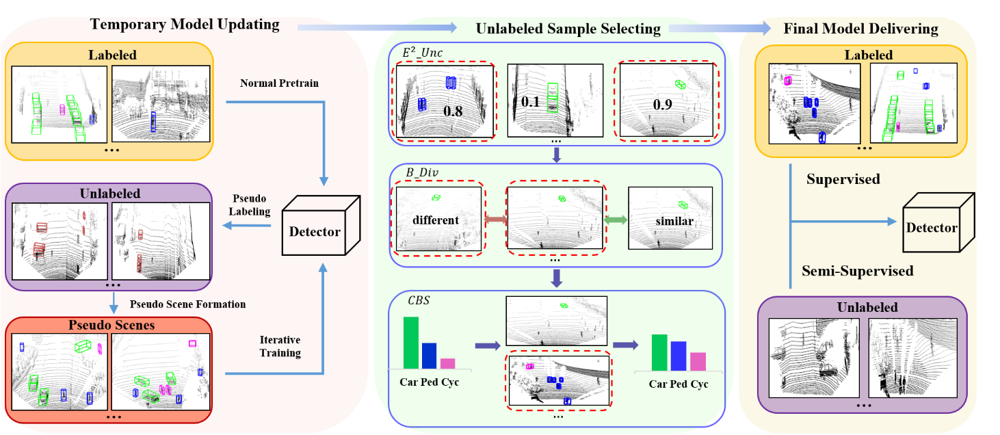

# S-SSAL

This repository is the official Pytorch implementation of our work:

[**Breaking the SSL-AL Barrier: A Synergistic Semi-Supervised Active Learning Framework for 3D Object Detection**](https://arxiv.org/abs/2501.15449)


## Overview

- [Installation](#installation)

- [Dataset Preparation](#dataset preparation)

- [Training & Evaluation](#training & evaluation)

- [Abstract](#abstract)

- [Acknowledgement](#acknowledgement)

- [Citation](#citation)


## Installation

Please follow ['[OpenPCDet]'](https://github.com/open-mmlab/OpenPCDet)  for installation.

We have verified our implementation in the following environment:

```
CUDA Version: 11.3
Python Version: 3.9.13
gcc (GCC) 7.5.0

Installed Packages:
- cumm-cu113: 0.2.8
- spconv-cu113: 2.1.21
- torch: 1.10.1
- torch-scatter: 2.1.0
- torchaudio: 0.10.1
- torchmetrics: 1.2.0
- torchvision: 0.11.2
```


## Dataset Preparation

We currently provide dataloaders for the KITTI and Waymo datasets.
 Simply place the datasets in the `data` directory with the following structure:

```
data/
├── kitti
└── waymo
```


## Training & Evaluation

```shell
# for KITTI 
bash scripts/kitti_sslal_train.sh # for Normal pretrain
bash scripts/kitti_sslal_train.sh # for CPSP pretrain (after normal pretrain)

# for Waymo 
bash scripts/waymo_sslal_train.sh # for Normal pretrain
bash scripts/waymo_sslal_train.sh # for CPSP pretrain (after normal pretrain)

```

Please refer to [Train_Eval](docs/train_eval.md) for more details.


## Abstract

To address the annotation burden in LiDAR-based 3D object detection, active learning (AL) methods offer a promising solution. However, traditional active learning approaches solely rely on a small amount of labeled data to train an initial model for data selection, overlooking the potential of leveraging the abundance of unlabeled data. Recently, attempts to integrate semi-supervised learning (SSL) into AL with the goal of leveraging unlabeled data have faced challenges in effectively resolving the conflict between the two paradigms, resulting in less satisfactory performance. To tackle this conflict, we propose a **S**ynergistic **S**emi-**S**upervised **A**ctive **L**earning framework, dubbed as **S-SSAL**. Specifically, from the perspective of SSL, we propose a Collaborative PseudoScene Pre-training (CPSP) method that effectively learns from unlabeled data without introducing adverse effects. From the perspective of AL, we design a Collaborative Active Learning (CAL) method, which complements the uncertainty and diversity methods by model cascading. This allows us to fully exploit the potential of the CPSP pre-trained model. Extensive experiments conducted on KITTI and Waymo demonstrate the effectiveness of our S-SSAL framework. Notably, on the KITTI dataset, utilizing only 2% labeled data, S-SSAL can achieve performance comparable to models trained on the full dataset.




## Acknowledgement

Our is implementation is based on ['[OpenPCDet]'](https://github.com/open-mmlab/OpenPCDet) and ['[CRB]'](https://github.com/Luoyadan/CRB-active-3Ddet) , thanks for their  outstanding contributions to the open-source community


## Citation

If you find this project useful in your research, please consider cite:

```latex
@article{wang2025breaking,
  title={Breaking the SSL-AL Barrier: A Synergistic Semi-Supervised Active Learning Framework for 3D Object Detection},
  author={Wang, Zengran and Zhang, Yanan and Chen, Jiaxin and Huang, Di},
  journal={arXiv preprint arXiv:2501.15449},
  year={2025}
}
```